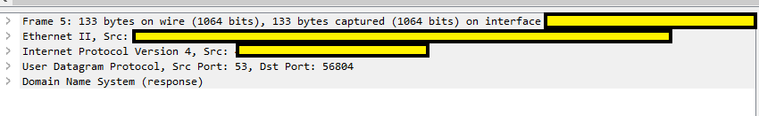

<h1 align="center">
<div align="center" ></div>
<br/>
An investigation of DNS resolution and web traffic inspection over trading bots. Risks and potential vulnerabilities. Part I
<br/><br/>
</h1>

<p align="center">This repository contains information and code related to the tools and techniques used for the Part 1 of the investigation of a possible vulnerability on trading bots authentication methods and their possible breaches.</p>

<p align="center">
  <a href="#tools-used-">Tools Used 🧰 </a> •
  <a href="#a-little-glossary-">A Little Glossary🙌</a> •
  <a href="#corpus-">Corpus📚</a> •
  <a href="#conclusion-">Conclusion🔎</a> •
  <a href="#license-">Licence📜</a> •
  <a href="#contributors-">Contributors🏗</a>
<br/><br/>
</p>

## Tools Used 🧰

<table align="center">
    <tr>
        <td>Ubuntu base OS </td>
        <td>Docker   </td>
        <td>Wireshark   </td>
    </tr>
    <tr>
        <td>
          <a href="https://ubuntu.com" target="_blank">
            
          </a>
        </td>
        <td>
          <a href="https://www.docker.com/" target="_blank">
            
          </a>
        </td>
        <td>
          <a href="https://vimejs.com/" target="_blank">
            
          </a>
        </td>
    </tr>
</table>
<table align="center">
    <tr>
        <td>Bind9 DNS server   </td>
        <td>Node.js   </td>
        <td>Fiddler   </td>
        <td>Postman   </td>
    </tr>
    <tr>
        <td>
          <a href="https://github.com/postcss/autoprefixer#readme" target="_blank">
              
          </a>
        </td>
        <td>
          <a href="https://nodejs.dev/en/" target="_blank">
             
          </a> 
        </td>
        <td>
          <a href="https://www.telerik.com/fiddler" target="_blank">
              
          </a>
        </td>
        <td>
          <a href="https://www.postman.com/" target="_blank">
              
          </a>
        </td>
    </tr>
</table>

## A Little Glossary 🙌

<p align="justify">Before diving into the corpus of the investigation here's a quick glossary of the main tools and some technical aspects as way of overviewing how everything fits one another.</p>

#### Wireshark Inspection

<p align="justify">As a first step, we used Wireshark, a well-known network traffic analyzer, to inspect and investigate all the traffic coming from the bot and how the procedure was. It resulted to be a very ilustrative proof of the methods and protocols used. Ended up being the guidance that marks our way to go.</p>

#### Docker

<p align="justify">The Docker Compose file orchestrates both services, DNS and HTTP server. We customized the networks, addresses, and explicitly exposed ports.</p>

<p align="justify">We connect containers through the creation of `dnsspoofing_network` and match addresses with **Bind9** DNS server configuration files. We also point to a preferred subnet to circumvent and identify possible failure areas.</p>

#### DNS Server

<p align="justify">We used an open source **Bind9 DNS Server** for our investigation. To configure the server, we used the following files:</p>

- `named.conf.options`      (for general configuration on DNS behaviour)
- `named.conf.local`        (to define the zone)
- `db.dummyendpoint.com`    (to define the zone with specific domain names and addresses)

<p align="justify">The addresses defined in db.dummyendpoint.com were referred to in the Docker Compose file.</p>

<p align="justify">Regarding the dockerfile, we need to copy, of course, all source data for the configuration and important here: expose UDP port for DNS to work. Lastly, we need to add a loop to maintain the container running.</p>

#### HTTP Server

<p align="justify">The HTTP server is a simple Node.js application that applies a **self-signed certificate** to establish an HTTPS connection. It includes a GET dummy call with a simple response. All of this is contained in `server.js`.</p>

#### DNS Resolutions

<p align="justify">To successfully trigger DNS resolution, we recommend flushing the DNS cache memory in the device with `ipconfig /flushdns`. This way, we allow Wireshark to identify and show all the captures regarding DNS resolution.</p>

#### Fiddler Investigation

<p align="justify">After analyzing the DNS resolutions using Wireshark, we proceeded to analyze the HTTP requests using Fiddler. Fiddler is a web debugging proxy tool that can intercept, modify, and inspect web traffic.</p>

<p align="justify">To capture the HTTP requests, we configured the device to use Fiddler as a proxy. With Fiddler capturing the traffic, we were able to see the HTTPS traffic and analyze the HTTP requests and responses. We focused on the requests made to the dummy endpoint and their subsequent responses.</p>

#### Postman Investigation

<p align="justify">Finally, we used Postman to automate the process of sending requests to the HTTP server. Postman is a popular tool for API development and testing, allowing us to send requests and analyze their responses.</p>

<p align="justify">Using Postman, we were able to send multiple custom requests to the HTTP server. We tested different types of requests, tweaking all the parameters, which gave us a few hints in regards to reverse engineering how the API works and behaves.</p>

## Corpus 📚

<p align="justify">It was brought to our attention a paid trading bot that was been used at that momment and (despite how we thought) this trading bot was using licences that could be remotely issued or revoked. So we started thinking about the concerns of this practice, because implementing a license validation protocol by using a simple API arquitecture could be a very vulnerable security method.
In this case after considering the range of possible vectors, we are only going to focus on the DNS spoofing practice as a way for the attacker to hack and bypass the licensing check system. </p>

<p align="justify">So to start off we tried to capture the traffic between the bot and the "API server", and for this we are going to use Wireshark.
DNS resolutions: for this to successfully being triggered, we recommend flushing the dns cache memory in the device with <code>ipconfig /flushdns</code>. This way we allow Wireshark to identify and show all the captures regarding dns resolution. 
Once this is done, we proceed to capture the traffic. On session ending, we save the output in the .pcapng file and analyze it. We will get quite a bunch of traffic lines, but Wireshark allows us to apply many filters to narrow down the results.  </p>

<div align="center"></div>

Executing that, we obtain a bunch of results:

<div align="center"></div>

<p align="justify">Results are obviously hidden because of confidentiality. Column names and addresses won't come by default in Wireshark; we need to tweak that to enable them. One excellent source for this is the bottom left corner block of information Wireshark shows us. This a summary of information captured divided by the tcp ip model layering. This ease the process of data identification depending on what we are looking for. In this case, we are pursuing the highest layer: application. In this case, DNS or Domain Name System. </p>

<div align="center"></div>

Let's open it. And there you go!

<div align="center"></div>

<p align="justify">In Queries and Answers tabs you can go and find subtabs named Name and Address. Those are, respectively, the names dns is trying to resolve and matching ip addresses. Wireshark comes with a nice feature to include this into the main output: right click and apply as column. </p>

<div align="center"></div>

<p align="justify">This way, we can easily have a quick sight on what's being resolved without needing to go to that specific tab every time. 
Let's move on. That was DNS, but it's only the first step. After that, we can investigate what is being done or hit towards those addresses we've seen. This is the most exciting part! And indeed, we find interesting signals. </p>

<p align="justify">Again, to narrow down the scope, we can execute another filtering. Most number of secure connections are done using TCP protocol. TCP is "connection oriented", which basically means it acknowledges connection between client and server before proceeding to send information over the wire. Then let's filter. </p>

<div align="center"></div>

<p align="justify">Immediately, we can identify traces of something surely known: the three way handshake of tcp connection. Each time a tcp connection is made, there is a process in which client and server exchange information to assure proper connection. This includes three steps: </p>

- Client sends SYN message
- Server replies SYN/ACK message
- Client confirms ACK message

<div align="center"></div>

<p align="justify">In the example, we can extract quite a lot of information. Not only the confirmation of the flags being sent, but also additional data, like client and server hello, processes in which they share information to accomplish the connection. For example the cipher type, keys and protocols. But that's out of scope.  </p>

<p align="justify">Another interesting thing is that you can check ACK is repeatedly sent over the lines. That's because of segmentation. If the request is responding with a large amount of data, tcp will slice the packets in needed units and client will reassemble them once they're completely sent. This a basic premise on network traffic. </p>

<p align="justify">TLSv1.2 is also something you can check in the traffic output. This is the upper security layer used by HTTPS nowadays. This basically ensures the encryption. You can find it as DNS in the bottom of the information block at the left bottom.  </p>

<div align="center"></div>

<p align="justify">Notice that, actually, is referring to HTTPS (Hypertext Transfer Protocol <strong>Secure</strong>). Those signs let you tie the ends. Check also how encrypted data is sent in the payload, assuring there's no possibility of sniffing. </p>

<div align="center"></div>

<p align="justify">And also, if you want to track the relationship between the different income lines, you can study acknowledge and sequence numbers. Applying those as columns (tcp segment length, sequence number and ack number) you can see how numbers match between consecutive calls. </p>

<div align="center"></div>

### Fiddler!

<p align="justify">Fiddler is other tool to inspect input/output network traffic. It has a very diaphanous output, showing you all incoming and outgoing connections. Also, at the right panel, there is one really useful tab called "Inspector", in which you can see headers, form data, payload, protocols, methods and more metadata.</p>

<p align="justify">You can even modify on the fly request and responses with fiddler scripts. This is really a feature at the time of troubleshooting and inspecting.</p>

<p align="justify">Let's take a look on an example to really check the power of this tool. When hitting and triggering some web traffick, a list of results will begin to appear on our screen. We will immediatelly see lines with details like protocol, kind of method, content types, urls, and so on. In the picture specific details have been hidden because of confidentiality.</p>

<div align="center"></div>

<p align="justify">You can also check the right panel, a great source of information. Like mentioned before, best tab here could be "Inspectors", which exposes a great amount of details regarding request and responses. Things like headers, method, protocol, versions, payloads, forms and so on. In fact, there are different formats for data viewing. The one selected is web forms, which lists all the parameters being sent to the server. Again, hidden.</p>

<p align="justify">Below, at bottom, you usually see the response data. Details like data body size, encryption or encoding types and, of course, also some tabs to accordingly display data at wish. In the following example, we see the headers for a server response.</p>

<div align="center"></div>

<p align="justify">Lastly, we can also check how an encrypted payload woud look like for the body in a server response.</p>

<div align="center"></div>

<p align="justify">With all this details you can rapidly understand how the process of gathering information could be executed just quick and easy, leading to the exploitation of possible vulnerabilities.</p>

## Conclusion 🔎

<p align="justify">Using the investigation tools and techniques mentioned above, we were able to identify and analyze DNS resolutions, HTTP requests, and API responses. This allowed us to detect any vulnerabilities or issues with the system and take appropriate action to address them.</p>

<p align="justify">We first took off from investigation and information collection: first step is knowing the target. Details, resources, methods, protocols, request, responses, headers. Whatever it comes, whatever is welcomed. For this first phase, we got involved into Wireshark, Fiddler and Postman.
Secondly, we build the simple infrastructure that let us recreate our own safe playground or environment. Then we can fit and assemble all the puzzle pieces into something bigger and functional.</p>

<p align="justify">And all of that drew the pathway to consolidation of information and potential attack vectors.</p>

**[⬆️ Back to Top](#an-investigation-of-dns-resolution-and-web-traffic-inspection-over-trading-bots-risks-and-potential-vulnerabilities-part-i)**

---

## License 📜

This repository's code is Licensed under [MIT X11](https://en.wikipedia.org/wiki/MIT_License)

```

Permission is hereby granted, free of charge, to any person obtaining a copy of this
software and associated documentation files (the "Software"), to deal in the Software
without restriction, including without limitation the rights to use, copy, modify, merge,
publish, distribute, sublicense, and/or sell copies of the Software, and to permit
persons to whom the Software is furnished to do so, subject to the following conditions:

The above copyright notice and this permission notice shall be included in all copies or
substantial portions of the Software.

THE SOFTWARE IS PROVIDED "AS IS", WITHOUT WARRANTY OF ANY KIND, EXPRESS OR IMPLIED,
INCLUDING BUT NOT LIMITED TO THE WARRANTIES OF MERCHANTABILITY, FITNESS FOR A PARTICULAR
PURPOSE AND NONINFRINGEMENT. IN NO EVENT SHALL THE AUTHORS OR COPYRIGHT HOLDERS BE
LIABLE FOR ANY CLAIM, DAMAGES, OR OTHER LIABILITY, WHETHER IN AN ACTION OF CONTRACT,
TORT OR OTHERWISE, ARISING FROM, OUT OF, OR IN CONNECTION WITH THE SOFTWARE OR THE USE
OR OTHER DEALINGS IN THE SOFTWARE.

Except as contained in this notice, Dashy shall not be used in advertising or otherwise
to promote the sale, use, or other dealings in this Software without prior written
authorization from the repo owner.
```

## Contributors 🏗

<table align="center" style="border: none">
<tr>
    <td align="center">
        <a href="https://github.com/ivanmirandastavenuiter">
            
            <br />
            <sub><b>Iván Miranda</b></sub>
        </a>
    </td>
    <td align="center">
        <a href="https://github.com/jrobles98">
            
            <br />
            <sub><b>José Robles</b></sub>
        </a>
    </td>
</table>

**[⬆️ Back to Top](#an-investigation-of-dns-resolution-and-web-traffic-inspection-over-trading-bots-risks-and-potential-vulnerabilities-part-i)**
